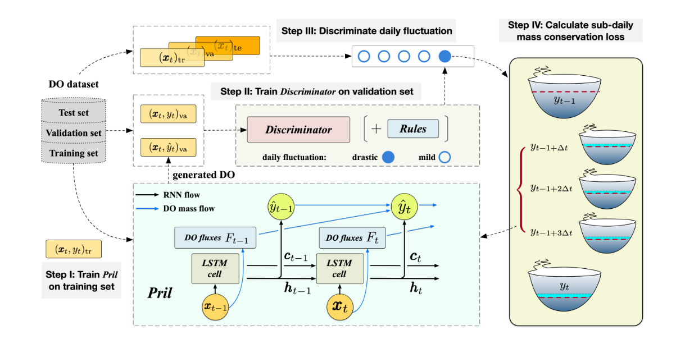

# Adaptive Process-Guided Learning: An Application in Predicting Lake DO Concentrations
This repository is the official implementation of **Adaptive Process-Guided Learning: An Application in Predicting Lake DO Concentrations** submitted to **ICDM-2024**



## Python environment
```shell
conda env create -f april.yml
```

## Usage

### (I) Data preprocessing
```
cd src/data
python3 main.py
```

### (II) Train April
#### Tips: Before training April, we recommend downloading the pretrained discriminator model from this [Google Drive link](https://drive.google.com/file/d/1a0j5-dQ9S4o3U1hPuH-8OimKS6zdhK1y/view?usp=sharing) to achieve consistent results similar to ours. After downloading the discriminator models, please follow the steps in [Section IV](#iv-train-dnn-model) to generate data and [Section VI](#vi-data-preprocessing-for-april) for data preprocessing for April.

#### 1. Pre-training stage

Shell script:
```sh
cd src/shell

./shell_pretrain_april.sh
```

Python script example:
```sh
cd src/train

python3 pretrain_main.py --model_type april --cluster_id 1 --model_index 1
```
| Argument       | Type | Default | Description                               | Choices                                 |
|----------------|------|---------|-------------------------------------------|-----------------------------------------|
| `--model_type` | str  | 'lstm'  | The model to be used.                     | 'lstm', 'pril', 'april', 'ea_lstm', 'transformer' |
| `--gpu`        | int  | 0       | GPU device ID to be used.                 |                                         |
| `--model_index`| int  | 1       | Model index which maps to a random seed.  |  1,2,3                                       |
| `--cluster_id` | int  | 1       | Cluster Id                                |  1,2,3,4                                |

#### 2. Fine tuning stage
Shell script
```sh
cd src/shell

./shell_finetune_april.sh
```


Python script example:

```sh 
cd src/train

python3 pretrain_main.py --model_type april --cluster_id 1 --model_index 1
```

| Argument       | Type | Default | Description                               | Choices                                 |
|----------------|------|---------|-------------------------------------------|-----------------------------------------|
| `--model_type` | str  | 'lstm'  | The model to be used.                     | 'lstm', 'pril', 'april', 'ea_lstm', 'transformer' |
| `--gpu`        | int  | 0       | GPU device ID to be used.                 |                                         |
| `--model_index`| int  | 1       | Model index which maps to a random seed.  |  1,2,3                                       |
| `--cluster_id` | int  | 1       | Cluster Id                                |  1,2,3,4                                |

### (III) Train Pril
#### 1. Pre-training stage

Shell script:
```sh
cd src/shell

./shell_pretrain_pril.sh
```

Python script example:
```sh
cd src/train

python3 pretrain_main.py --model_type pril --cluster_id 1 --model_index 1

```

#### 2. Fine tuning stage
Shell script
```sh
cd src/shell

./shell_finetune_pril.sh
```


Python script example:

```sh 
cd src/train

python3 finetune_main.py --model_type april --cluster_id 1 --model_index 1
```

### (IV) Train discriminator model

Load existing discriminator models and generate data:
```sh
cd src/shell

./shell_use_dnn.sh
```

Retrain discriminator models and generate data:
```sh
cd src/shell

./shell_train_dnn.sh
```

example:
```
python3 train_DNN_all_lakes.py --model_index 1 --cluster_id 1 --TrainDNN 0
```
| Argument        | Type | Default | Description                                                               | Choices                                 |
|-----------------|------|---------|---------------------------------------------------------------------------|-----------------------------------------|
| `--gpu`         | int  | 0       | GPU device ID to be used.                                                 |                                         |
| `--model_index` | int  | 1       | Model index which maps to a random seed.                                  | 1, 2, 3                                 |
| `--cluster_id`  | int  | 1       | Cluster Id                                                                | 1, 2, 3, 4                              |
| `--TrainDNN`    | int  | 1       | Set to 1 to retrain the discriminator model and generate data; set to 0 to load existing discriminator models and generate data. | 0, 1                                    |

### (VI) Data preprocessing for April

```
cd src/data

python3 preprocess_extend.py
```


## Directory Descriptions
```text
Project Directory/
│
├── data/                   # Datasets storage
│
├── model/                  # Contains the April model and baseline architectures with related files
│
├── src/                    # Source code
│   ├── config/             # Configuration files (hyperparameters, environment variables, settings)
│   ├── data/               # Data preprocessing and loading functions
│   ├── draw_pics/          # Functions to generate visualizations
│   ├── evaluate/           # Model evaluation functions
│   ├── geo_map/            # Functions to generate geographical maps
│   ├── models/             # Model-related functions
│   ├── shell/              # Shell scripts
│   ├── train/              # Model training scripts
│   ├── utils/              # Utility functions
│
├── april.yml               # Environment configuration file for this project
│
└── README.md               # Project documentation
```

## Contact

Should you have any questions regarding our paper or codes, please don't hesitate to reach out via email at chq29@pitt.edu or ruy59@pitt.edu.


## Acknowledgment 
Our code is developed based on [GitHub - jdwillard19/MTL_lakes-Torch: Meta Transfer Learning for Lake Temperature Prediction](https://github.com/jdwillard19/MTL_lakes).


